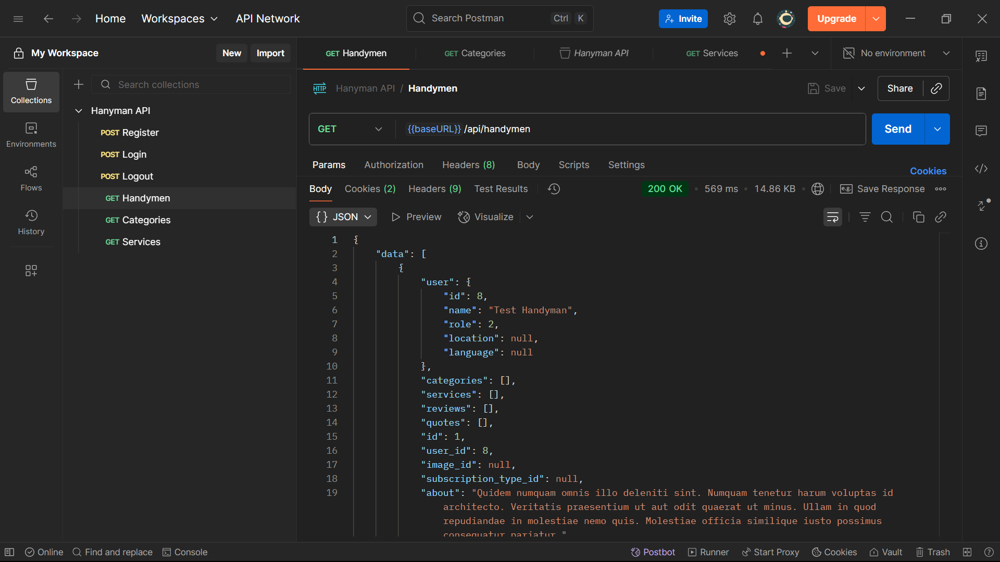

# Handyman API

A RESTful API for the Handyman web application, built with Laravel. Provides endpoints for user authentication, handyman management, and admin panel access.



## Features

-   User authentication
-   Admin panel
-   Handyman management, search & filter
-   Database migrations and seeding
-   API documentation
-   Ready-to-use test accounts
-   Comprehensive test suite

---

## Getting Started

### 1. Clone the Repository

```bash
git clone https://github.com/miketorreno/handyman-api.git

cd handyman-api
```

### 2. Install Dependencies

```bash
# Install PHP, Composer, and Laravel Installer (if not already installed)
/bin/bash -c "$(curl -fsSL https://php.new/install/linux/8.4)"

composer install
```

### 3. Configure Environment

```bash
cp .env.example .env
# Edit .env to add your database credentials
```

### 4. Start the Development Environment (Docker with Sail)

```bash
./vendor/bin/sail up -d

# Or add this alias to your shell:
alias sail='sh $([ -f sail ] && echo sail || echo vendor/bin/sail)'

sail up -d
```

### 5. Generate Application Key

```bash
sail artisan key:generate
```

### 6. Install Filament Admin Panel

```bash
sail artisan filament:install --panels
```

### 7. Run Migrations & Seed Database

```bash
sail artisan migrate:fresh --seed
```

### 8. Generate API Documentation

```bash
sail artisan scribe:generate
```

### 9. Start the Development Server

```bash
sail artisan serve
```

---

## Usage

### API Documentation

-   [http://{baseUrl}/docs](http://{baseUrl}/docs)

### Admin Panel

-   [http://{baseUrl}/admin](http://{baseUrl}/admin)

#### Test Accounts

```
USER
email: user@handyman.com
password: password

ADMIN
email: admin@handyman.com
password: password
```

---

## Authentication

All API requests require the following header:

```
Accept: application/json
Authorization: Bearer [token]
```

### Register

**POST** `{baseUrl}/api/register`

**Body:**

```
name: string
email: string
password: string
password_confirmation: string
```

Returns a user object and API token.

### Login

**POST** `{baseUrl}/api/login`

**Body:**

```
email: string
password: string
```

Returns a user object and API token.

### Logout

**POST** `{baseUrl}/api/logout`

Requires Authorization header.

---

## API Endpoints

-   `GET {baseUrl}/api/handymen` — List all handymen
-   `GET {baseUrl}/api/handymen?services={serviceIds}&categories={categoryIds}&location={location}` — Filter for handymen by category, service, or location
-   `GET {baseUrl}/api/handymen/{handymanId}` — Get a specific handyman
-   `GET {baseUrl}/api/categories` — List service categories
-   `GET {baseUrl}/api/services` — List all services
-   Additional endpoints (see [API docs](http://{baseUrl}/docs))

---

## Testing

Run the test suite:

```bash
sail artisan test
```

---

## Contribution

1. Fork the repository and create your branch.
2. Write clear, concise commits and add tests for new features.
3. Open a pull request with a description of your changes.

---

## License

See [LICENSE](LICENSE) for details.
